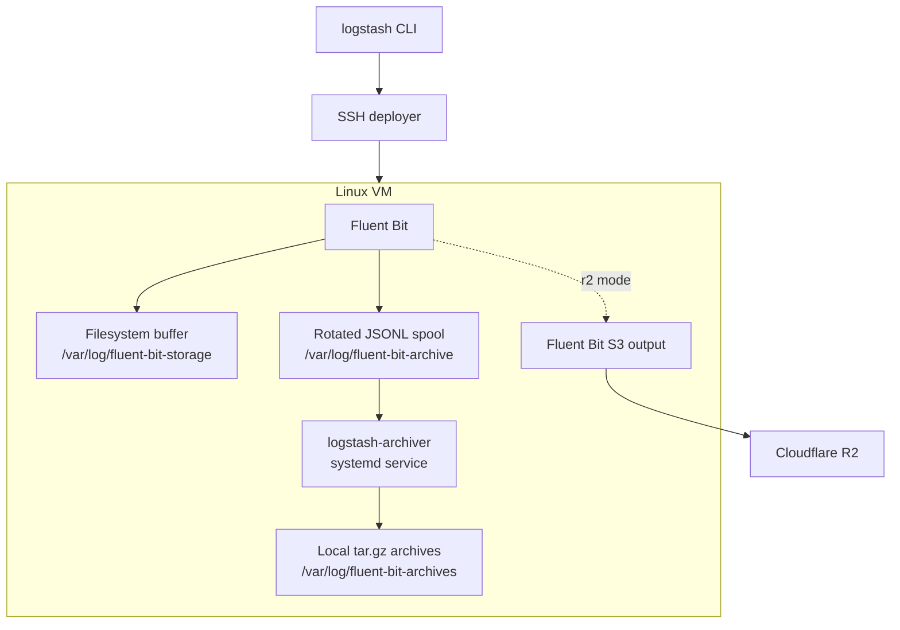

# Logstash Backend

A Go-based VM log archival tool. The control-plane CLI connects to a Linux VM over SSH, installs and configures Fluent Bit, optionally builds and installs a Go archiver daemon, and configures local or Cloudflare R2 storage.

## Scope

### In scope

- SSH-based VM deployment.
- Password or private-key SSH authentication.
- Idempotent Fluent Bit installation and service activation.
- Optional teardown of the previous Fluent Bit installation.
- Fluent Bit filesystem buffering and retry behavior.
- Collection of common Ubuntu VM logs.
- Local JSONL log storage.
- Rotated-file compression into timestamped `tar.gz` archives.
- Automatic cross-compilation and transfer of the archiver daemon.
- systemd and logrotate installation for the archiver workflow.
- A Fluent Bit S3-compatible configuration for Cloudflare R2.

### Not yet complete

- The Go archiver uploader is currently an interface, not an R2 implementation.
- `--storage r2` currently uses Fluent Bit's direct S3-compatible output and produces compressed `.gz` objects, not Go-created `.tar.gz` archives.
- The `retrieve` command has validation and service boundaries but no archive backend yet.
- Archive manifests, checksums, indexing, and Archive-tier rehydration are not implemented.

## Architecture

The system is split into layers so deployment, collection, compression, and storage can evolve independently.



### Layer 1: CLI

Location: `cmd/logstash` and `internal/cli`

Responsibilities:

- Parse deployment and retrieval commands.
- Validate authentication, storage, time ranges, and build targets.
- Pass a typed request to the deployer service.
- Avoid accepting R2 secrets as command-line arguments.

Available commands:

```text
logstash deploy
logstash retrieve
logstash version
```

### Layer 2: Deployment orchestration

Location: `internal/deployer`

The deployer:

1. Validates the requested SSH authentication method.
2. Builds the archiver locally for `linux-amd64` or `linux-arm64`.
3. Opens one authenticated SSH session.
4. Streams the installer, configuration, binary, systemd unit, and logrotate policy to the VM.
5. Optionally stops and removes the previous Fluent Bit installation.
6. Starts Fluent Bit and verifies that it is active.
7. Installs and enables the archiver service when requested.

The binary transfer is embedded in the SSH setup stream, so a separate `scp` command is not required.

### Layer 3: VM collection

Location: `scripts/fluent-bit.conf` and `scripts/fluent-bit-r2.conf`

The default Fluent Bit input tails:

```text
/var/log/syslog
/var/log/auth.log
/var/log/kern.log
/var/log/cloud-init.log
/var/log/cloud-init-output.log
```

Fluent Bit tracks file offsets in:

```text
/var/lib/fluent-bit/tail.db
```

It starts from new records with `Read_from_Head Off` and uses filesystem buffering for temporary failures.

### Layer 4: Compression engine

Location: `internal/archiver` and `cmd/logstash-archiver`

The archiver scans completed rotated files matching `*.jsonl.*`. It then:

1. Sorts the completed spool files.
2. Creates a temporary archive.
3. Adds the spool files to a tar stream.
4. Compresses the tar stream with gzip.
5. Atomically renames the temporary file.
6. Deletes source spool files only after successful archive creation.
7. Calls the uploader interface when one is configured.

Archive names use UTC timestamps:

```text
logs_archive_20260930_034933.tar.gz
```

If an upload fails, the completed archive and source files remain available for retry.

### Layer 5: Storage

#### Local mode

```text
Fluent Bit -> rotated JSONL -> Go archiver -> local tar.gz
```

Local archives are written to:

```text
/var/log/fluent-bit-archives
```

#### R2 mode

The current R2 configuration uses Fluent Bit's S3-compatible output:

```text
Fluent Bit -> gzip chunk -> Cloudflare R2
```

R2 credentials are supplied through environment variables and installed on the VM as a root-only file:

```text
/etc/fluent-bit/r2.env
```

The planned final R2 flow is:

```text
Fluent Bit -> rotated JSONL -> Go archiver -> tar.gz -> R2
```

## Deployment

Run commands from the repository root.

### Local storage with x86_64 archiver

```bash
go run ./cmd/logstash deploy \
  --host 20.244.10.108 \
  --user azureuser \
  --auth password \
  --storage local \
  --archiver-build linux-amd64
```

### Local storage with ARM64 archiver

```bash
go run ./cmd/logstash deploy \
  --host <host> \
  --user <user> \
  --auth password \
  --storage local \
  --archiver-build linux-arm64
```

### Private-key authentication

```bash
go run ./cmd/logstash deploy \
  --host <host> \
  --user <user> \
  --auth private-key \
  --identity-file ~/.ssh/id_ed25519 \
  --storage local \
  --archiver-build linux-amd64
```

### Skip teardown

Teardown is enabled by default. To preserve the existing Fluent Bit installation:

```bash
--teardown=false
```

Teardown removes the old Fluent Bit package and configuration but preserves:

```text
/var/lib/fluent-bit
/var/log/fluent-bit-storage
```

### Dry run

```bash
go run ./cmd/logstash deploy \
  --host <host> \
  --user <user> \
  --auth password \
  --storage local \
  --archiver-build linux-amd64 \
  --dry-run
```

## R2 configuration

Set R2 values in the environment before deployment:

```bash
export R2_ENDPOINT="https://<account-id>.r2.cloudflarestorage.com"
export R2_BUCKET="my-log-archive"
export R2_ACCESS_KEY_ID="<access-key>"
export R2_SECRET_ACCESS_KEY="<secret-key>"
export R2_PREFIX="logs"
```

Deploy using:

```bash
go run ./cmd/logstash deploy \
  --host <host> \
  --user <user> \
  --auth password \
  --storage r2 \
  --archiver-build linux-amd64
```

Do not put R2 secrets in command-line flags. They can be exposed through shell history and process inspection.

## VM services and paths

| Component                 | Service or path                   |
| ------------------------- | --------------------------------- |
| Fluent Bit service        | `fluent-bit.service`              |
| Archiver service          | `logstash-archiver.service`       |
| Fluent Bit configuration  | `/etc/fluent-bit/fluent-bit.conf` |
| Fluent Bit state database | `/var/lib/fluent-bit/tail.db`     |
| Fluent Bit retry buffer   | `/var/log/fluent-bit-storage`     |
| Rotated spool files       | `/var/log/fluent-bit-archive`     |
| Completed local archives  | `/var/log/fluent-bit-archives`    |
| R2 environment file       | `/etc/fluent-bit/r2.env`          |

Useful checks on the VM:

```bash
sudo systemctl status fluent-bit
sudo systemctl status logstash-archiver
sudo journalctl -u fluent-bit -f
sudo journalctl -u logstash-archiver -f
sudo ls -lh /var/log/fluent-bit-archives
sudo du -sh /var/log/fluent-bit-storage
```

## Manual archiver test

The archiver can be tested without a running Fluent Bit instance:

```bash
mkdir -p /tmp/logstash-spool /tmp/logstash-archives
echo '{"message":"test archive"}' > /tmp/logstash-spool/vm-logs.jsonl.1

go run ./cmd/logstash-archiver \
  --spool-dir /tmp/logstash-spool \
  --archive-dir /tmp/logstash-archives \
  --once

tar -tzf /tmp/logstash-archives/logs_archive_*.tar.gz
```

## Development

Run all tests:

```bash
go test ./...
```

Build the archiver for an Azure x86_64 VM:

```bash
GOOS=linux GOARCH=amd64 \
  go build -o /tmp/logstash-archiver-linux-amd64 \
  ./cmd/logstash-archiver
```

The deploy command performs this build automatically when `--archiver-build` is not `none`.

## Reliability model

- Fluent Bit persists input offsets in a local database.
- Fluent Bit persists retry chunks on disk.
- Log rotation creates completed files for the archiver.
- Archive creation uses a temporary file and atomic rename.
- Source files are not removed before successful archive creation.
- Failed uploads leave files available for retry.
- systemd restarts the archiver after process failure.
- The local buffer has a configured size limit and requires disk monitoring.

## Security considerations

- Password authentication is handled by OpenSSH and is not passed as a CLI argument.
- Private-key authentication uses `BatchMode=yes`.
- R2 credentials are written with mode `0600` on the VM.
- SSH deployment runs the remote setup through `sudo bash -s`.
- Log files may contain authentication and sensitive operational data. Access to `/var/log/auth.log`, archives, buffers, and R2 objects must be restricted.
- Archive retention and deletion policies should be defined before production use.

## Roadmap

1. Implement the R2 uploader for the Go archiver.
2. Replace direct Fluent Bit R2 uploads when exact `.tar.gz` archives are required.
3. Add archive manifests with checksums, source VM, time range, and record counts.
4. Implement the `retrieve` backend for local and R2 archives.
5. Add archive retention and cleanup policies.
6. Add integration tests against a disposable Linux VM.
7. Add production observability for spool size, archive age, upload failures, and service health.
